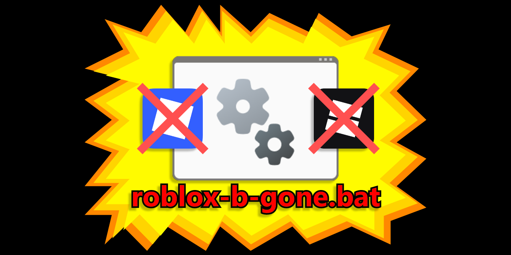

# roblox-b-gone

Are Roblox icons breeding on your desktop like digital cockroaches?

Are you haunted by shortcuts that come back every single update?

BANG! BANG! Say goodbye with ROBLOX-B-GONE™ – the no-nonsense, icon-vaporizing solution you've been dreaming of (but didn’t know you needed)!

## How does it work?
roblox-b-gone is a simple Bloxstrap custom integration that runs automatically every time you open Roblox.
It removes those pesky auto-generated icons so you don’t have to lift a finger.

## Installation
* Download roblox-b-gone.bat from the releases page
* Open your launcher ([Bloxstrap](https://github.com/bloxstraplabs/bloxstrap),[Fishstrap](https://github.com/fishstrap/fishstrap), etc.)
* Head to the Integrations section
* Scroll to Custom Integrations and add roblox-b-gone.bat
    
Pro tip: Place the .bat file in your launcher’s installation folder to keep things tidy — though it’ll work just fine from anywhere.
    

## Improvements
While .bat works, it’s not the most elegant. Ideally, we’ll move to something less intrusive (no flashing command window).
Have an idea? Want to improve it?
Issues and pull requests are welcome! Let’s make this thing slicker together.

PS: Work at Roblox? Please read [this](https://devforum.roblox.com/t/studio-should-not-attempt-to-create-a-desktop-shortcut-every-time-it-updates/223733) devforum post and finally fix this!
